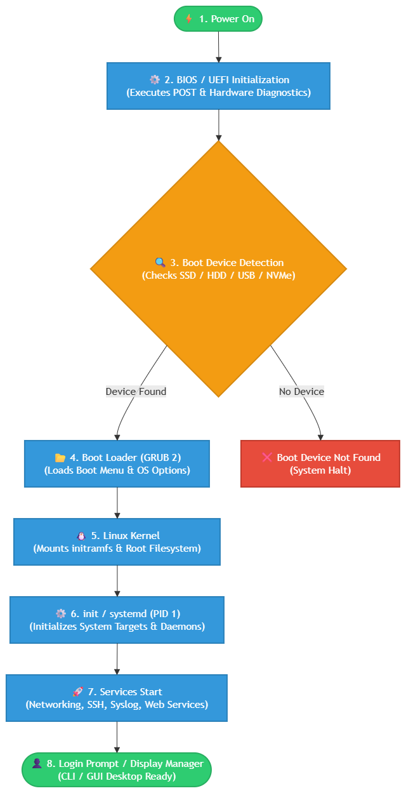

# Enterprise Server Deployment and Operating System Installation
**Course:** ITEP 414 – System Administration and Maintenance[cite: 2]  
**Institution:** Laguna State Polytechnic University (LSPU)[cite: 2]  
**Instructor:** John Randolf M. Penaredondo, MIT[cite: 2]  
**Student Name:** [Your Full Name Here]  
**Username:** `gahi` | **Hostname:** `server01`[cite: 2]  
**Program:** Bachelor of Science in Information Technology (BSIT)[cite: 2]  
**Week:** 3 Portfolio Project[cite: 2]  

---

## 📋 Table of Contents
- [1. Project Overview](#1-project-overview)
- [2. Learning Objectives](#2-learning-objectives)
- [3. Virtual Machine Specifications](#3-virtual-machine-specifications)
- [4. Installation Summary](#4-installation-summary)
- [5. Configuration Summary](#5-configuration-summary)
- [6. Verification Results](#6-verification-results)
- [7. BIOS vs UEFI Highlights](#7-bios-vs-uefi-highlights)
- [8. Embedded Boot Process Flowchart](#8-embedded-boot-process-flowchart)
- [9. Challenges Encountered](#9-challenges-encountered)
- [10. Reflection](#10-reflection)
- [11. References](#11-references)

---

## 1. Project Overview
Operating Systems serve as the foundation of every enterprise IT infrastructure[cite: 2]. Before a server can host websites, databases, cloud services, or enterprise applications, it must first be properly installed, configured, secured, and documented[cite: 2].

In this project, I assumed the role of a **Junior System Administrator** at **ABC Startup Solutions** tasked with deploying a clean, production-ready Ubuntu Server virtual machine[cite: 2]. This documentation records the complete operating system deployment, user credentialing, network verification, repository security upgrades, firmware architecture analysis, and boot process mapping to ensure future administrators can reliably reproduce the installation[cite: 2].

---

## 2. Learning Objectives
- **Explain** the essential purpose of operating systems in enterprise environments[cite: 2].
- **Differentiate** legacy BIOS and modern UEFI firmware architecture and partition standards[cite: 2].
- **Trace** the stages of the computer boot sequence from power-on to user login[cite: 2].
- **Install and configure** an Ubuntu Server virtual machine following enterprise best practices[cite: 2].
- **Verify** server health, network stack addressing, internet connectivity, and SSH remote administration[cite: 2].
- **Produce** professional technical documentation and reproducible installation records[cite: 2].

---

## 3. Virtual Machine Specifications

| Component / Parameter | Minimum Requirement[cite: 2] | Implemented Laboratory Configuration |
| :--- | :--- | :--- |
| **Virtual Machine Name** | `Ubuntu-Server-Week03`[cite: 2] | `Ubuntu-Server-Week03`[cite: 2] |
| **Operating System** | Ubuntu Server LTS[cite: 2] | Ubuntu Server 64-bit (`GNU/Linux 7.0.0-29-generic x86_64`) |
| **Base Memory (RAM)** | 4 GB[cite: 2] | 2048 MB – 4096 MB |
| **Processor (vCPU)** | 2 Virtual Processors[cite: 2] | 2 vCPUs |
| **Virtual Storage** | 40 GB (VDI/VMDK)[cite: 2] | 20.0 GB – 40.0 GB (`ext4` root filesystem)[cite: 2] |
| **Network Adapter** | NAT (or Bridged)[cite: 2] | NAT (`enp0s3`)[cite: 2] |
| **Assigned Hostname** | `server01`[cite: 2] | `server01`[cite: 2] |
| **Administrative Account** | Non-root administrator[cite: 2] | `gahi`[cite: 2] |

---

## 4. Installation Summary
1. **Hypervisor Setup:** Provisioned a virtual machine container configured for 64-bit Linux architecture within Oracle VM VirtualBox[cite: 2].
2. **OS Setup & Drive Allocation:** Attached the Ubuntu Server ISO image, set language/keyboard localization, and finalized the guided entire disk partition layout[cite: 2].
3. **Identity & Remote Access:** Defined the administrative user (`gahi`), set system hostname (`server01`), and enabled the OpenSSH Server package during setup[cite: 2].
4. **Reboot & Cleanup:** Ejected virtual installation media upon installer completion and booted into the virtual console[cite: 2].

---

## 5. Configuration Summary
- **Authentication:** Validated rootless administrative logon directly through console `tty1`[cite: 2].
- **Host Identification:** Verified system hostname resolution for internal network management as `server01`[cite: 2].
- **Network Stack:** Configured automatic DHCP IPv4 leasing on interface `enp0s3` along with IPv6 SLAAC address assignment[cite: 2].
- **Remote Access Daemon:** Confirmed OpenSSH daemon initialization for secure remote administrative access[cite: 2].
- **Security Updates:** Executed package cache updates and upgraded installed distribution binaries using `apt`[cite: 2].

---

## 6. Verification Results

### Task 1: User Login Verification
- **Execution:** Successfully authenticated as administrative user `gahi` via terminal console `tty1`[cite: 2].
- **Screenshot:**

---

### Task 2: Hostname Verification
- **Command:** `hostname`[cite: 2]
- **Output:** `server01`[cite: 2]
- **Screenshot:**

---

### Task 3: IP Address Verification
- **Command:** `ip addr`[cite: 2]
- **Output:**
  - Loopback (`lo`): `127.0.0.1/8`[cite: 2]
  - Ethernet Adapter (`enp0s3`): `10.0.2.15/24` (MAC: `08:00:27:7b:37:e5`, State: `UP`)[cite: 2]
- **Screenshot:**

---

### Task 4: Internet Connectivity Test
- **Command:** `ping -c 4 google.com`[cite: 2]
- **Output:** `4 packets transmitted, 4 received, 0% packet loss, time 3045ms` (Round-trip avg: `10.263 ms`)[cite: 2]
- **Screenshot:**

---

### Task 5: System Package Update & Upgrade
- **Command:** `sudo apt update && sudo apt upgrade -y`[cite: 2]
- **Output:** Synchronized package lists, upgraded dependencies, processed triggers for `systemd`, `rsyslog`, and `dbus`, and regenerated initial RAM disk image (`update-initramfs: Generating /boot/initrd.img-7.0.0-29-generic`)[cite: 2].
- **Screenshot:**

---

## 7. BIOS vs UEFI Highlights

| Evaluation Criteria | BIOS (Basic Input/Output System)[cite: 2] | UEFI (Unified Extensible Firmware Interface)[cite: 2] |
| :--- | :--- | :--- |
| **Architecture** | 16-bit legacy ROM execution mode; limited to 1 MB memory address space. | 32-bit / 64-bit modern firmware environment with modular drivers. |
| **Boot Mechanism** | Executes POST, reads MBR on Sector 0, hands off to the active partition bootloader.[cite: 2] | Reads EFI System Partition (ESP) directly and executes `.efi` bootloader binaries.[cite: 2] |
| **Maximum Storage** | Restricted to 2.2 TB disk capacity under 32-bit Logical Block Addressing (LBA).[cite: 2] | Supports up to 9.4 ZB (Zettabytes) under 64-bit addressing.[cite: 2] |
| **Partition Table** | Master Boot Record (MBR) — maximum of 4 primary partitions.[cite: 2] | GUID Partition Table (GPT) — up to 128 standard partitions without extended logical drives.[cite: 2] |
| **Security Features** | Basic firmware passwords; susceptible to rootkits and boot sector malware.[cite: 2] | Secure Boot with cryptographic signature validation and TPM integration.[cite: 2] |
| **Boot Performance** | Slower sequential hardware diagnostics and initialization.[cite: 2] | Faster parallel hardware initialization and direct kernel loading.[cite: 2] |

---

## 8. Embedded Boot Process Flowchart

The flowchart illustrates the sequential execution stages of the Ubuntu boot pipeline[cite: 2]:

### Summary of Stages:
1. **Power On:** System receives power and hardware power rails stabilize[cite: 2].
2. **BIOS / UEFI Initialization:** Executes Power-On Self-Test (POST) and initializes base hardware[cite: 2].
3. **Boot Device Detection:** Probes available NVMe, SSD, HDD, or USB block devices[cite: 2].
4. **Boot Loader (GRUB 2):** Loads the GRUB configuration file and displays OS selection menu[cite: 2].
5. **Linux Kernel:** Mounts `initramfs`, detects hardware devices, and loads the root filesystem[cite: 2].
6. **init / systemd (PID 1):** Spawns PID 1 to orchestrate system targets and service dependencies[cite: 2].
7. **Services Start:** Activates network daemons, SSH, firewall, and background services[cite: 2].
8. **Login Prompt:** Spawns console `tty1` login or graphical display manager ready for user authentication[cite: 2].

---

## ⚠️ Challenges Encountered
1. **Command Syntax Misalignment:** Inadvertently entering `hostname hostname` instead of querying the configuration with plain `hostname` or using `sudo hostnamectl set-hostname`, which triggered the command-line usage help screen[cite: 2].
2. **Managing Service Deferrals:** During distribution upgrades, `needrestart` deferred restarting core system daemons (`dbus.service` and user sessions) until background tasks finished or the system was rebooted[cite: 2].
3. **Headless Terminal Diagnostics:** Validating network adapters, IP allocations, and package triggers purely through the text-based TTY console without a graphical desktop interface[cite: 2].

---

## 💭 Reflection
Completing this Week 3 laboratory project on enterprise server deployment and operating system installation provided essential hands-on experience in building a Linux infrastructure foundation from scratch[cite: 2]. Prior to this deployment, I viewed operating system installation as a routine task requiring minimal planning[cite: 2]. Working through the complete deployment of Ubuntu Server within Oracle VirtualBox shifted my perspective by demonstrating the precision required to configure enterprise-grade server settings, network adapters, storage partitions, and security daemons[cite: 2].

The most challenging task during this laboratory was navigating the headless command-line interface to execute system verification routines without relying on a graphical user interface[cite: 2]. Analyzing network interface properties and CIDR notations with `ip addr`, confirming external gateway routing via ICMP ping commands, and managing repository upgrades using APT demanded strict attention to detail[cite: 2]. Additionally, resolving background daemon deferrals during the upgrade process provided practical insight into how Linux daemons interact with the active kernel, as well as the importance of `initramfs` rebuilding during kernel updates[cite: 2].

Gaining a solid understanding of system architecture—particularly the fundamental differences between legacy BIOS and modern UEFI firmware—deepened my technical foundation[cite: 2]. Learning how UEFI leverages 64-bit execution, Secure Boot cryptographic verification, and the GUID Partition Table (GPT) to overcome legacy MBR disk limitations clarified why UEFI has become the modern enterprise standard[cite: 2]. Furthermore, mapping the step-by-step Linux boot sequence from hardware POST and GRUB2 to systemd initialization (PID 1) gave clear context to what occurs behind the console prompt[cite: 2].

This project significantly aids my development as a System Administrator by reinforcing the importance of rigorous technical verification, documentation discipline, and standardized deployment practices[cite: 2]. Rather than merely running an automated installer, I learned how to validate network availability, manage SSH remote access services, and ensure host security through structured update workflows[cite: 2]. These foundational competencies are vital for maintaining high server availability, deploying cloud infrastructure, and supporting enterprise services across production IT environments[cite: 2].

---

## 📚 References
- Canonical Ltd. (2024). *Official Ubuntu Server Guide & Deployment Documentation*. https://docs.ubuntu.com[cite: 2]
- Oracle Corporation. (2023). *Oracle VM VirtualBox User Manual*. https://www.virtualbox.org/manual/[cite: 2]
- Linux Foundation. (2023). *Systemd System and Service Manager Architectural Standards*. https://systemd.io/[cite: 2]
- Unified EFI Forum. (2023). *UEFI Specification Version 2.10*. https://uefi.org/specifications[cite: 2]
